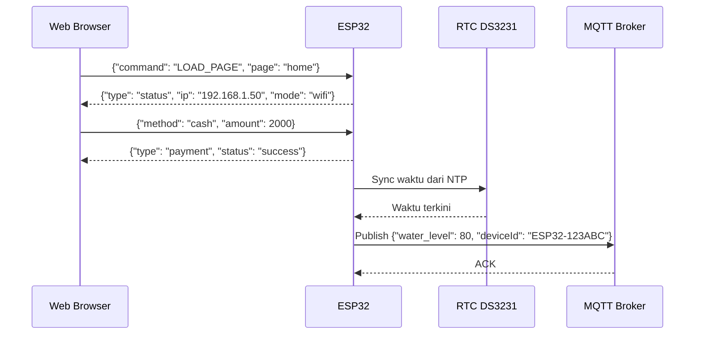

# Dokumentasi JSON Komunikasi ESP32 <-> Web (WebSocket & REST)

Dokumen ini mendefinisikan format JSON standar yang digunakan untuk komunikasi antara **ESP32** dengan **Web** (dashboard/browser) melalui **WebSocket** dan **REST API**.

---

## 📡 Struktur Pesan WebSocket

### 1. Permintaan dari Web ke ESP32
```json
{
  "command": "LOAD_PAGE",
  "page": "home"
}
```

| Field     | Tipe   | Deskripsi |
|-----------|--------|-----------|
| command   | string | Perintah yang dikirim ke ESP32 |
| page      | string | Halaman yang diminta (`home`, `ads`, `status`, dll) |

### 2. Status Update dari ESP32 ke Web
```json
{
  "type": "status",
  "ip": "192.168.1.50",
  "mode": "wifi",
  "ssid": "MyWiFi",
  "rssi": -65,
  "uptime": "2h 13m",
  "heap": 142,
  "mqtt": "connected",
  "eth": "disconnected",
  "firmware": "v1.2.3",
  "deviceId": "ESP32-123ABC"
}
```

| Field     | Tipe   | Deskripsi |
|-----------|--------|-----------|
| type      | string | Jenis pesan (`status`) |
| ip        | string | Alamat IP perangkat |
| mode      | string | Mode koneksi (`wifi` / `ethernet`) |
| ssid      | string | SSID jika mode WiFi |
| rssi      | int    | Sinyal WiFi dalam dBm |
| uptime    | string | Lama perangkat menyala |
| heap      | int    | Free heap memory (KB) |
| mqtt      | string | Status MQTT (`connected`/`disconnected`) |
| eth       | string | Status Ethernet |
| firmware  | string | Versi firmware |
| deviceId  | string | ID unik perangkat |

### 3. Update Level Air
```json
{
  "type": "water_level",
  "level": 75,
  "last_updated": "2025-09-04T19:20:00Z"
}
```

| Field     | Tipe   | Deskripsi |
|-----------|--------|-----------|
| type      | string | `water_level` |
| level     | int    | Persentase level air (0-100) |
| last_updated | string | Timestamp terakhir update |

### 4. Event Pembayaran
```json
{
  "type": "payment",
  "method": "qr",
  "status": "success",
  "amount": 5000,
  "currency": "IDR",
  "orderId": "ORD12345"
}
```

| Field   | Tipe   | Deskripsi |
|---------|--------|-----------|
| type    | string | `payment` |
| method  | string | Metode pembayaran (`qr`, `rfid`, `cash`) |
| status  | string | Status pembayaran (`pending`, `success`, `failed`) |
| amount  | int    | Jumlah nominal pembayaran |
| currency| string | Mata uang |
| orderId | string | ID unik transaksi |

### 5. Notifikasi Telegram
```json
{
  "type": "telegram",
  "enabled": true,
  "message": "Isi ulang berhasil 500ml oleh user RFID:12345"
}
```

| Field    | Tipe   | Deskripsi |
|----------|--------|-----------|
| type     | string | `telegram` |
| enabled  | bool   | Apakah notifikasi Telegram aktif |
| message  | string | Isi pesan notifikasi |

---

## 🌐 Struktur REST API

### `GET /api/status`
Respons:
```json
{
  "ip": "192.168.1.50",
  "mode": "wifi",
  "ssid": "MyWiFi",
  "mqtt": "connected",
  "uptime": "2h 13m",
  "firmware": "v1.2.3"
}
```

### `POST /api/set_config`
Body:
```json
{
  "net_mode": "wifi",
  "device_name": "DispenserAir01",
  "wifi_ssid": "MyWiFi",
  "wifi_pass": "password123",
  "mqtt_host": "broker.hivemq.com",
  "mqtt_port": 1883,
  "mqtt_user": "user1",
  "mqtt_pass": "pass1",
  "mqtt_topic": "dispenser/status",
  "tg_token": "123456:ABCDEF",
  "tg_chat": "987654321",
  "tg_notifications": true
}
```

### `POST /api/set_water_level`
```json
{
  "level": 80
}
```

### `POST /api/calibrate`
```json
{
  "point1_ml": 200,
  "point1_pulse": 350,
  "point2_ml": 1000,
  "point2_pulse": 1750
}
```

### `POST /api/payment`
```json
{
  "method": "cash",
  "amount": 2000,
  "currency": "IDR"
}
```

---

## 🔄 Flow Komunikasi (Sequence)



---

## 📖 Catatan
- Semua waktu menggunakan format **ISO 8601** (`YYYY-MM-DDTHH:MM:SSZ`).
- Nilai boolean hanya `true` atau `false`.
- Komunikasi **utama via WebSocket**, REST hanya untuk integrasi tambahan.
